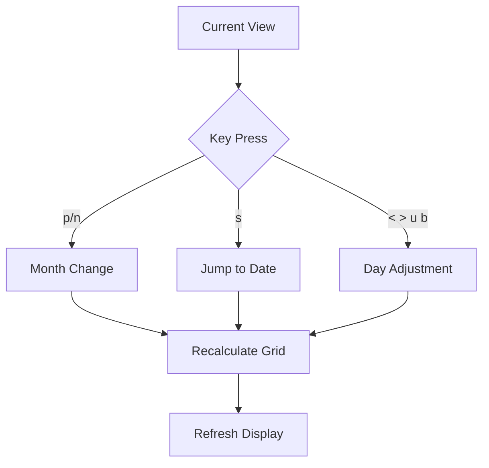
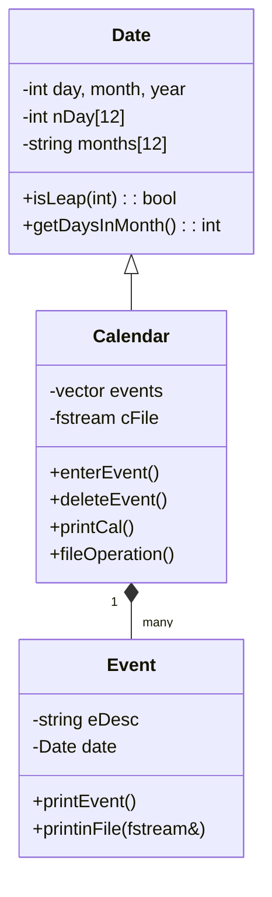
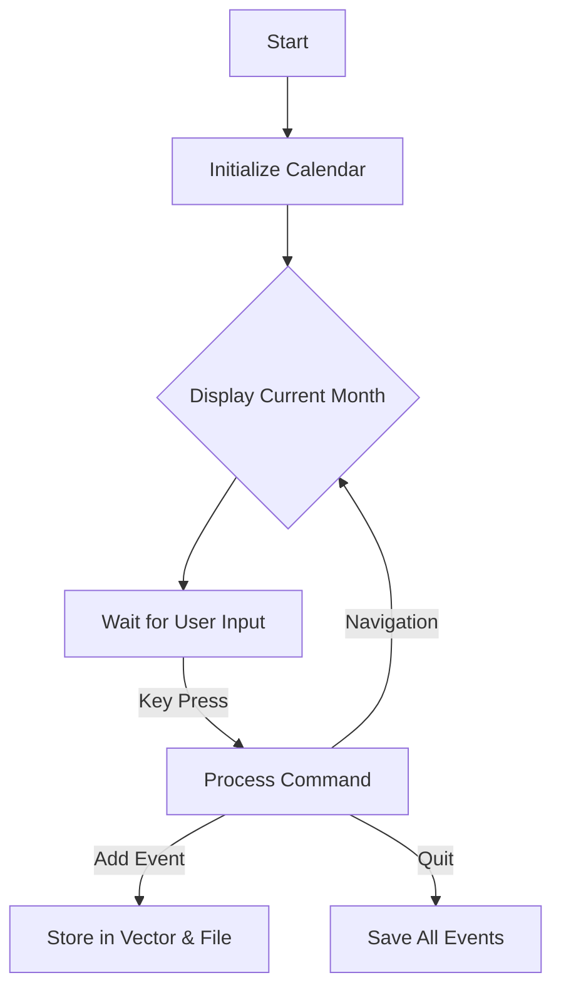
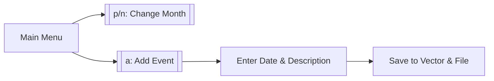

```markdown
# 📅 C++ Calendar Application - Complete Documentation

## Table of Contents
1. [Features](#-features)
2. [Installation](#-installation)
3. [Command Reference](#-command-reference)
4. [Technical Report](#project-report-advanced-calendar-application-in-c)
5. [System Architecture](#2-system-architecture)
6. [Key Functions](#3-deep-dive-into-key-functions)
7. [User Flow](#4-user-interaction-flowchart)
8. [Error Handling](#5-error-handling-mechanisms)
9. [Conclusion](#8-conclusion)

---

## 📌 Features  
- **Calendar Display**: View monthly layouts with current day highlighted  
- **Event Management**: Add, delete, and list events with reminders  
- **Navigation**:  
  - Switch months/years (`p`/`n` keys)  
  - Jump to specific dates (`s` key)  
  - Daily/weekly navigation (`<`/`>`, `u`/`b` keys)  
- **Data Persistence**:  
  - Auto-save events to `2.718281828459045235.txt`  
  - Export/import to custom files  
- **Input Validation**: Robust handling for dates/commands  

## 🛠️ Installation  
```bash
g++ main.cpp -o calendar -std=c++11 && ./calendar
```

## 🧭 Navigation Command Reference

### **Month/Year Navigation**
| Key | Action | Behavior | Visual Feedback |
|-----|--------|----------|-----------------|
| `p` | Previous Month | Decrements month (wraps to December if January) | Month header updates<br>Day positions shift left |
| `n` | Next Month | Increments month (wraps to January if December) | Month header updates<br>Day positions shift right |
| `s` | Specific Date | Prompts for:<br>▪ Month (1-12)<br>▪ Year (≥1)<br>▪ Optional day | Jumps to target date<br>Highlights `[DAY]` if provided |

**Example Flow**:
```plaintext
> s
Enter Month: 12
Enter Year: 2024
[Optional] Day: 25
[Calendar now shows December 2024 with [25] highlighted]
```

### **Daily/Weekly Navigation**
| Key | Action | Behavior | Boundary Handling |
|-----|--------|----------|-------------------|
| `<` | Previous Day | `day -= 1` | Rolls to prev month if day=1 |
| `>` | Next Day | `day += 1` | Rolls to next month if day=31 |
| `u` | Last Week | `day -= 7` | Adjusts month/year if crossing boundaries |
| `b` | Next Week | `day += 7` | Adjusts month/year if crossing boundaries |

**Visual Indicators**:
- Current day always marked with `[ ]`
- Week navigation preserves relative day position

### **Special Cases**
1. **Leap Years**:
   ```plaintext
   February 2024:
   [28] → `>` → [29] (Leap day)
   [29] → `>` → [1] (March)
   ```
2. **BCE Dates**:
   ```plaintext
   > s
   Month: 1 Year: -44 (44 BCE)
   Shows January 44 BCE with Julian calendar rules
   ```

### **Navigation Flowchart**


**Tips**:
1. Press `c` to quickly return to current date
2. Combine `s` with no day input to view month overview
3. Week navigation (`u`/`b`) maintains same month
```

## ⌨️ Command Reference  
| Key | Action                  | Example Usage          |  
|-----|-------------------------|------------------------|  
| `a` | Add event               | `a → 5 16 2025 "Meeting"` |  
| `d` | Delete event            | `d → [ID]`             |  
| `f` | Save to file            | `f → events_backup.txt`|  
| `g` | Go to event             | `g → [ID]`             |  
| `q` | Quit                    | `q` (Exits program)    |  

## 📂 File Formats
### System Auto-Save File (`2.718281828459045235.txt`)
Stores events in a compact format for program reloading:
```plaintext
[YEAR] [MONTH] [DAY]
[Event Description]
```
Example:
```plaintext
2025 5 16
Team Meeting
2025 6 19
Doctor's Appointment
```

### Custom Export Files (User-Specified)
Saved in human-readable format when using `f` command:
```plaintext
Date: [DAY]/[MONTH]/[YEAR]
Description: [Event Description]

```
Example:
```plaintext
Date: 16/5/2025
Description: Team Meeting

Date: 19/6/2025
Description: Doctor's Appointment
```

Key Differences:
| Feature          | Auto-Save Format | Custom Export Format |
|------------------|------------------|----------------------|
| **Structure**    | Raw data         | Labeled fields       |
| **Delimiters**   | Spaces           | Slashes (dates)      |
| **Readability**  | Machine-optimal  | Human-friendly       |
| **Extension**    | .txt             | User-defined         |

# **Technical Report: Advanced Calendar Application in C++**  

## **1. System Architecture**  
### **1.1 Class Diagram**  


### **1.2 Program Flow**  


## **2. Core Functionality**  
### **2.1 Date Validation (`isLeap`)**  
```cpp
bool Date::isLeap(int year) {
    return (year % 4 == 0 && year % 100 != 0) || (year % 400 == 0);
}
```

### **2.2 Calendar Rendering**  
**Output Example**:  
```
Sun Mon Tue Wed Thu Fri Sat
          1   2   3   4   5
  6   7   8   9  10  11  12
 13 14  15  16  [17] 18 |19|
```

### **2.3 Event Persistence**  
**File Format**:  
```plaintext
2025 5 16
Team Meeting
```

## **3. User Interaction**  


## **4. Error Handling**  
```cpp
while (day > nDay[month-1]) { 
    cerr << "Invalid day!"; 
    cin >> day; 
}
```

## **5. Visual Demonstration**  
![Calendar Screenshot]


- `|19|` = Event day  
- `[17]` = Current day  

## **6. Conclusion**  
This application demonstrates:  
✔ Modular OOP design  
✔ Robust file persistence  
✔ Intuitive keyboard controls  

**Future Work**:  
- Recurring events  
- GUI interface  
- Cloud synchronization  

[📜 MIT License](LICENSE.txt)
```
