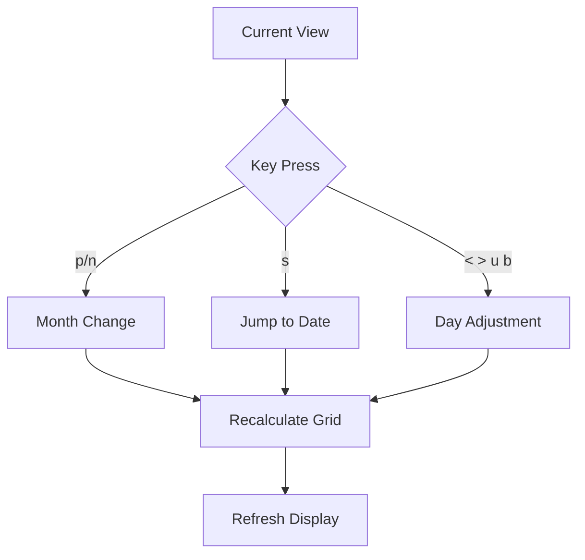
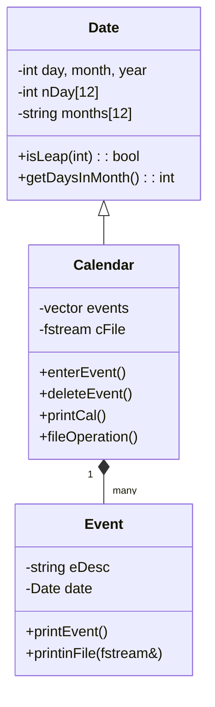
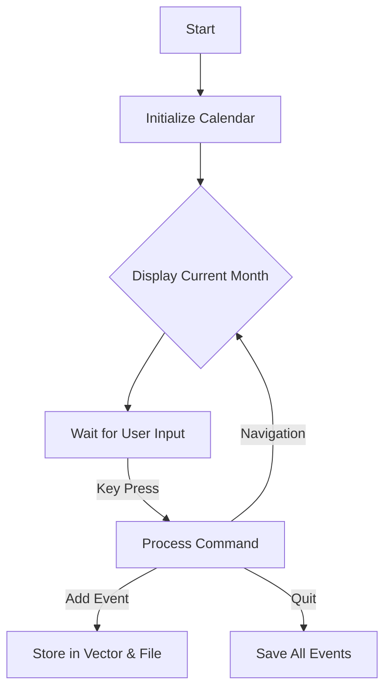
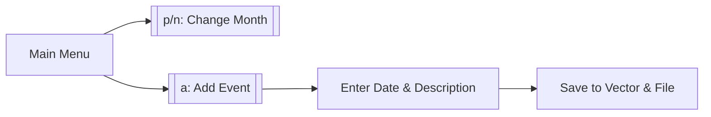

```markdown
# 📅 C++ Calendar Application - Complete Documentation

## Table of Contents
1. [Features](#-features)
2. [Installation](#-installation)
3. [Command Reference](#-command-reference)
4. [Technical Report](#project-report-advanced-calendar-application-in-c)
5. [System Architecture](#2-system-architecture)
6. [Key Functions](#3-deep-dive-into-key-functions)
7. [User Flow](#4-user-interaction-flowchart)
8. [Error Handling](#5-error-handling-mechanisms)
9. [Conclusion](#8-conclusion)

---

## 🌟 Features
- **Interactive Calendar Display**
  - Highlight current day `[17]` and events `|19|`
  - Support for both AD and BCE dates
- **Comprehensive Event Management**
  - Add/delete events with reminders
  - View all events chronologically
- **Intuitive Navigation**
  - Month/year, daily/weekly movement
  - Quick jump to specific dates
- **Data Persistence**
  - Automatic saving/loading
  - Custom export/import functionality
- **Robust Validation**
  - Date validation
  - Error-resistant command handling

---

## 🛠️ Installation
```bash
# Compile and run
g++ main.cpp -o calendar -std=c++11 && ./calendar
```

---

## 🖥️ Usage

### Navigation Commands
| Key | Action | Example | Behavior |
|-----|--------|---------|----------|
| `p` | Previous month | `p` | Wraps to December at January |
| `n` | Next month | `n` | Wraps to January at December |
| `s` | Specific date | `s 12 2024 25` | Jumps to Dec 25, 2024 |
| `u` | Previous week | `u` | Moves back 7 days |
| `b` | Next week | `b` | Moves forward 7 days |
| `c` | Current date | `c` | Returns to today |

### Event Commands
| Key | Action | Example |
|-----|--------|---------|
| `a` | Add event | `a 15 5 2024 "Meeting"` |
| `d` | Delete event | `d 2` (deletes event ID 2) |
| `l` | List events | Shows all events |

### System Commands
| Key | Action | Example |
|-----|--------|---------|
| `f` | Export events | `f events.txt` |
| `i` | Import events | `i backup.txt` |
| `q` | Quit program | Saves before exiting |

---

**Visual Indicators**:
- Current day always marked with `[ ]`
- Week navigation preserves relative day position

### **Special Cases**
1. **Leap Years**:
   ```plaintext
   February 2024:
   [28] → `>` → [29] (Leap day)
   [29] → `>` → [1] (March)
   ```
2. **BCE Dates**:
   ```plaintext
   > s
   Month: 1 Year: -44 (44 BCE)
   Shows January 44 BCE with Julian calendar rules
   ```

### **Navigation Flowchart**


**Tips**:
1. Press `c` to quickly return to current date
2. Combine `s` with no day input to view month overview
3. Week navigation (`u`/`b`) maintains same month
```

## ⌨️ Command Reference  
| Key | Action                  | Example Usage          |  
|-----|-------------------------|------------------------|  
| `a` | Add event               | `a → 5 16 2025 "Meeting"` |  
| `d` | Delete event            | `d → [ID]`             |  
| `f` | Save to file            | `f → events_backup.txt`|  
| `g` | Go to event             | `g → [ID]`             |  
| `q` | Quit                    | `q` (Exits program)    |  

## 📂 File Formats
### System Auto-Save File (`2.718281828459045235.txt`)
Stores events in a compact format for program reloading:
```plaintext
[YEAR] [MONTH] [DAY]
[Event Description]
```
Example:
```plaintext
2025 5 16
Team Meeting
2025 6 19
Doctor's Appointment
```

### Custom Export Files (User-Specified)
Saved in human-readable format when using `f` command:
```plaintext
Date: [DAY]/[MONTH]/[YEAR]
Description: [Event Description]

```
Example:
```plaintext
Date: 16/5/2025
Description: Team Meeting

Date: 19/6/2025
Description: Doctor's Appointment
```

Key Differences:
| Feature          | Auto-Save Format | Custom Export Format |
|------------------|------------------|----------------------|
| **Structure**    | Raw data         | Labeled fields       |
| **Delimiters**   | Spaces           | Slashes (dates)      |
| **Readability**  | Machine-optimal  | Human-friendly       |
| **Extension**    | .txt             | User-defined         |

# **Technical Report: Advanced Calendar Application in C++**  

## **1. System Architecture**  
### **1.1 Class Diagram**  


### **1.2 Program Flow**  


## **2. Core Functionality**  
### **2.1 Date Validation (`isLeap`)**  
```cpp
bool Date::isLeap(int year) {
    return (year % 4 == 0 && year % 100 != 0) || (year % 400 == 0);
}
```

### **2.2 Calendar Rendering**  
**Output Example**:  
```
Sun Mon Tue Wed Thu Fri Sat
          1   2   3   4   5
  6   7   8   9  10  11  12
 13 14  15  16  [17] 18 |19|
```

### **2.3 Event Persistence**  
**File Format**:  
```plaintext
2025 5 16
Team Meeting
```

## **3. User Interaction**  


## **4. Error Handling**  
```cpp
while (day > nDay[month-1]) { 
    cerr << "Invalid day!"; 
    cin >> day; 
}
```

## **5. Visual Demonstration**  
![Calendar Screenshot]


- `|19|` = Event day  
- `[17]` = Current day  

### Key Algorithms
- **Zeller's Congruence** for weekday calculation
- **Leap year detection** (including BCE dates)
- **Smart date wrapping** for month/year transitions

## **6. Conclusion**  
This application demonstrates:  
✔ Modular OOP design  
✔ Robust file persistence  
✔ Intuitive keyboard controls  

**Future Work**:  
- Recurring events  
- GUI interface  
- Cloud synchronization  

[📜 MIT License](LICENSE.txt)

