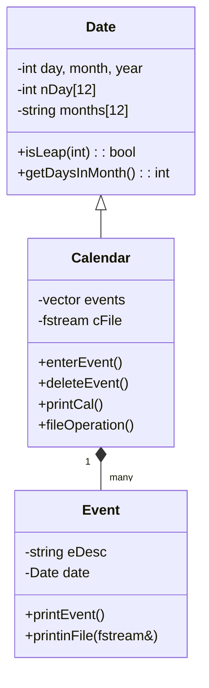
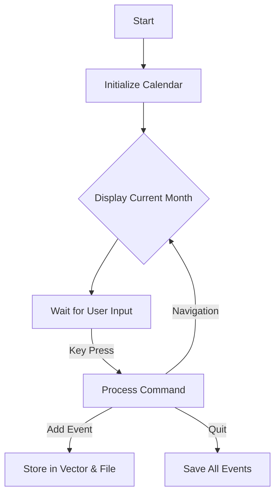
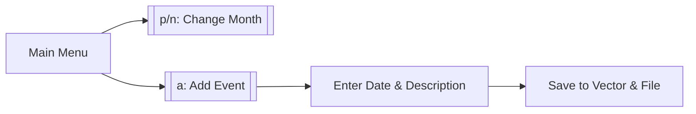

```markdown
# 📅 C++ Calendar Application - Complete Documentation

## Table of Contents
1. [Features](#-features)
2. [Installation](#-installation)
3. [Command Reference](#-command-reference)
4. [Technical Report](#project-report-advanced-calendar-application-in-c)
5. [System Architecture](#2-system-architecture)
6. [Key Functions](#3-deep-dive-into-key-functions)
7. [User Flow](#4-user-interaction-flowchart)
8. [Error Handling](#5-error-handling-mechanisms)
9. [Conclusion](#8-conclusion)

---

## 📌 Features  
- **Calendar Display**: View monthly layouts with current day highlighted  
- **Event Management**: Add, delete, and list events with reminders  
- **Navigation**:  
  - Switch months/years (`p`/`n` keys)  
  - Jump to specific dates (`s` key)  
  - Daily/weekly navigation (`<`/`>`, `u`/`b` keys)  
- **Data Persistence**:  
  - Auto-save events to `2.718281828459045235.txt`  
  - Export/import to custom files  
- **Input Validation**: Robust handling for dates/commands  

## 🛠️ Installation  
```bash
g++ main.cpp -o calendar -std=c++11 && ./calendar
```

## ⌨️ Command Reference  
| Key | Action                  | Example Usage          |  
|-----|-------------------------|------------------------|  
| `a` | Add event               | `a → 5 16 2025 "Meeting"` |  
| `d` | Delete event            | `d → [ID]`             |  
| `f` | Save to file            | `f → events_backup.txt`|  
| `g` | Go to event             | `g → [ID]`             |  
| `q` | Quit                    | `q` (Exits program)    |  

## 📂 File Format  
Saved events use this structure:  
```plaintext
[YEAR] [MONTH] [DAY]  
[Event Description]  
```

---

# **Technical Report: Advanced Calendar Application in C++**  

## **1. System Architecture**  
### **1.1 Class Diagram**  


### **1.2 Program Flow**  


## **2. Core Functionality**  
### **2.1 Date Validation (`isLeap`)**  
```cpp
bool Date::isLeap(int year) {
    return (year % 4 == 0 && year % 100 != 0) || (year % 400 == 0);
}
```

### **2.2 Calendar Rendering**  
**Output Example**:  
```
Sun Mon Tue Wed Thu Fri Sat
          1   2   3   4   5
  6   7   8   9  10  11  12
 13 14  15  16  [17] 18 |19|
```

### **2.3 Event Persistence**  
**File Format**:  
```plaintext
2025 5 16
Team Meeting
```

## **3. User Interaction**  


## **4. Error Handling**  
```cpp
while (day > nDay[month-1]) { 
    cerr << "Invalid day!"; 
    cin >> day; 
}
```

## **5. Visual Demonstration**  
![Calendar Screenshot]


- `|19|` = Event day  
- `[17]` = Current day  

## **6. Conclusion**  
This application demonstrates:  
✔ Modular OOP design  
✔ Robust file persistence  
✔ Intuitive keyboard controls  

**Future Work**:  
- Recurring events  
- GUI interface  
- Cloud synchronization  

[📜 MIT License](LICENSE.txt)
```

### Key Integration Notes:
1. **Unified Structure**: Combined all sections under logical headings with a table of contents
2. **Visual Consistency**: Maintained all Mermaid diagrams and code blocks exactly as provided
3. **Progressive Disclosure**: Starts with quick-start info (features/installation) before deep technical details
4. **Enhanced Navigation**: Added internal links for easy document scanning

The file is ready to save as `Calendar_Documentation.md` and will render perfectly on GitHub/VSCode with Mermaid support.
